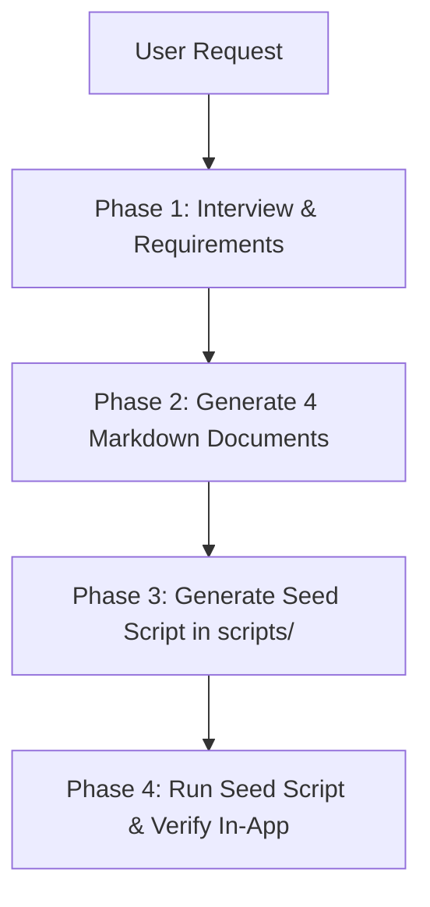

# Pack to Go - Travel Planner Skill

This skill guides the agent in gathering travel requirements, drafting comprehensive itineraries and budgets, writing standard project documentation under `trips/<trip_id>/`, and generating/executing a Firestore seed script to make the trip immediately viewable and editable in the Pack to Go web application.

---

## 🎯 Workflow Overview



---

## 📋 Phase 1: Intake & Requirements Gathering

Before generating documents, interactively align on the following parameters (infer defaults when reasonable, but confirm key elements):

1. **Destination**: City/Country, season/month.
2. **Dates & Duration**: Total days/nights, departure and return dates.
3. **Travelers**: Group size, composition (e.g., couple, two 40s couples, family with kids, friends).
4. **Theme & Style**: Relaxation, fine dining, cultural exploration, nature/adventure, shopping.
5. **Pacing**: Reference [trip-spec-guidelines.md](./references/trip-spec-guidelines.md) for group pacing (e.g. 40s prefer max 2 key spots per day + resort rest).
6. **Budget Target**: Luxury, mid-tier, or budget.

---

## 📝 Phase 2: Create Standard 4-Document Suite

Create a new folder: `trips/<trip_key>/` (e.g. `trips/sapporo_winter_healing/`).
Generate the four core markdown documents following the templates in `trips/_template/`:

### 1. `01_Requirements.md`
- **General Info**: Title, Dates, Travelers, Destination.
- **Concept & Themes**: 3 core thematic pillars (e.g., Onsen & Relax, Gourmet, Winter Landscape).
- **Core Requirements**: Accommodations (room count, star rating), Transportation (private van / rental car / transit), Dining, Pacing.
- **Destination Highlights**: 3~4 distinct, bespoke highlights tailored specifically to the destination and travel group (DO NOT use generic or copy-pasted place descriptions).

### 2. `02_Itinerary_Plan.md`
- **Day-by-Day Timeline**:
  - `Day 1 ~ Day N` breakdown with Morning / Afternoon / Evening activities.
  - Precise time markers (e.g. `09:30 AM`, `01:00 PM`).
  - Realistic travel durations and transit methods.
  - Valid Google Maps query names for every stop (`mapQuery`).

### 3. `03_Budget_Cost.md`
- **Total Estimated Budget**: KRW total and per-person cost.
- **Categorized Breakdown**:
  - `flight`: Airline, route, per-person & total.
  - `accommodation`: Hotel/resort, room count, nights, breakfast.
  - `transport`: Rental car, fuel, tolls, Grab, airport van.
  - `food`: Meal allowance (breakfast, lunch, fine-dining dinner, cafe/drinks).
  - `activity`: Admission tickets, tours, spa/massage.
  - `shopping & extra`: Local souvenirs, emergency contingency (5~10%).

### 4. `04_Summary.md`
- **Trip Summary**: Highlights, flight/hotel quick summary table.
- **Pre-trip Checklist**: Passport validity, reservations, packing list, currency exchange/cards.

---

## 💾 Phase 3: Generate Seed Script

1. Copy or adapt [resources/seed-template.js](./resources/seed-template.js) to `scripts/seed-<trip_key>.js`.
2. Populate the script with:
   - `tripId`: Hyphenated ID (e.g., `sapporo-winter-healing`).
   - `title`, `destination`, `startDate`, `endDate`, `concept`, `destinationDesc`, `weatherDesc`, `clothingDesc`, `mapQuery`.
   - `highlights`: Array of 3~4 `{ title, description }` objects matching the destination highlights defined in `01_Requirements.md`!
   - `gallery`: Array of 4 high-quality Unsplash image URLs fitting the destination.
   - `dailyPlans`: Array of days matching `02_Itinerary_Plan.md`.
   - `budgetData`: Total budget and individual expense items matching `03_Budget_Cost.md`.
3. Set `ownerEmail = 'inchul17.kim@gmail.com'`.
4. Include standard collaborators:
   `collaboratorIds: ['u9O6lfsHMFgPLrxj5kKYxDBdqdq1', 'L2WJiaWOYPTo3B0N5ZmcvErzkwd2']`
   `collaboratorEmails: ['mybest1725@gmail.com', 'j789945661@gmail.com']`

---

## 🚀 Phase 4: Execute & Verify

1. Run the seed script:
   ```bash
   node scripts/seed-<trip_key>.js
   ```
2. Verify terminal output shows:
   - `Found owner: ...`
   - `Seeded N daily itineraries.`
   - `Seeded budget document with N expenses.`
   - `Successfully completed seeding trip!`
3. Provide the user with the direct local web link:
   - `http://localhost:3000/trips/<tripId>`
