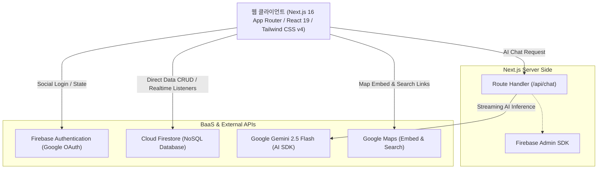
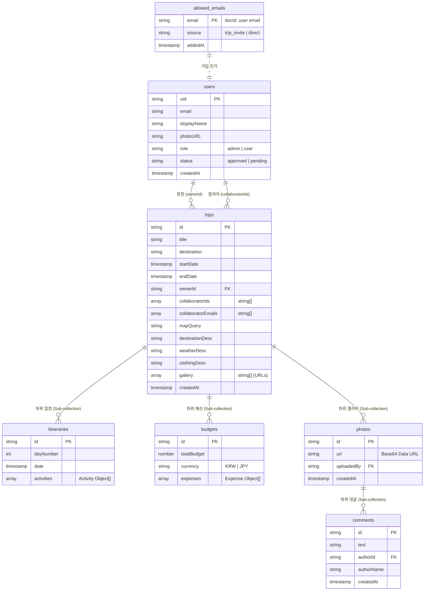
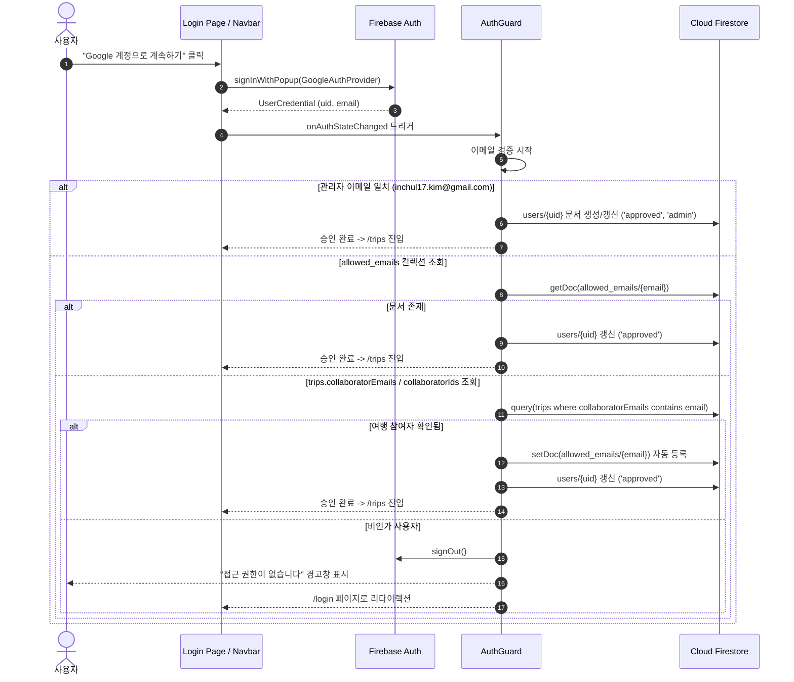
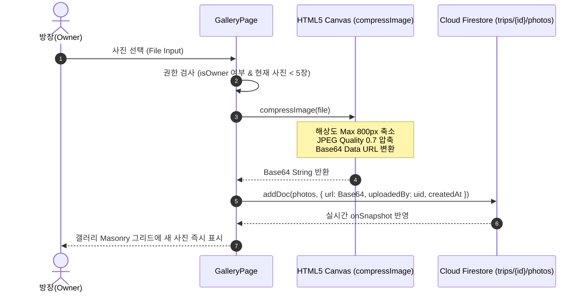

# 시스템 사양서 (System Specification)

**프로젝트명**: Pack to Go (여행 협업 및 일정·예산·갤러리 관리 서비스)  
**작성일**: 2026-08-21  
**문서 버전**: v1.0.0  
**상태**: 기준 소스 코드 기반 최신화 완료  

---

## 1. 시스템 아키텍처 개요 (System Architecture)

### 1.1 기술 스택 구성



| 계층 (Layer) | 기술 스택 | 버전 / 설명 |
| :--- | :--- | :--- |
| **Frontend Core** | Next.js (App Router), React, TypeScript | Next.js 16.3.1 (Turbopack), React 19.2.8, TS 5 |
| **Styling & UI** | Tailwind CSS, Lucide React | Tailwind CSS v4, Lucide React 1.31.0 |
| **State & Context** | React Context API, Custom Hooks | `TripContext`, `useTrip`, `useChat` |
| **Backend & BaaS** | Firebase Web SDK, Firebase Admin SDK | Firebase 12.17.1, Firebase Admin 14.2.0 |
| **AI Integration** | Vercel AI SDK, Google Generative AI | `ai` 7.0.66, `@ai-sdk/google` 4.0.44 (`gemini-2.5-flash`) |
| **Runtime & Build** | Node.js, Turbopack | Node.js 20+, Next.js Turbopack |

---

## 2. 디렉터리 및 모듈 구조 (Directory & Module Structure)

```text
tour/
├── docs/                               # 프로젝트 문서 (사양서, 요구사항 정의서)
│   ├── REQUIREMENTS_SPECIFICATION.md
│   └── SYSTEM_SPECIFICATION.md
├── public/                             # 정적 자산 (배너, 파비콘, 갤러리 이미지 등)
│   ├── banner.jpg
│   └── gallery/
├── scripts/                            # 시드 데이터 및 관리 스크립트
│   ├── delete_okinawa.ts
│   ├── seed-okinawa-40s.ts
│   └── seed_okinawa.ts
├── src/
│   ├── app/                            # Next.js App Router 페이지 및 API 라우트
│   │   ├── api/
│   │   │   └── chat/
│   │   │       └── route.ts            # Gemini AI 스트리밍 API 엔드포인트
│   │   ├── login/
│   │   │   └── page.tsx                # 구글 로그인 페이지
│   │   ├── trips/
│   │   │   ├── [id]/                   # 여행 상세 하위 라우트
│   │   │   │   ├── budget/page.tsx     # 예산 관리 탭
│   │   │   │   ├── gallery/page.tsx    # 사진 갤러리 및 댓글 탭
│   │   │   │   ├── itinerary/page.tsx  # 일정표 타임라인 탭
│   │   │   │   ├── members/page.tsx    # 멤버 초대 및 관리 탭 (방장 전용)
│   │   │   │   ├── layout.tsx          # 여행 상세 레이아웃 & Provider 주입
│   │   │   │   └── page.tsx            # 여행 개요(Overview) 탭
│   │   │   └── page.tsx                # 내 여행 탐색 및 목록 페이지
│   │   ├── globals.css                 # 전역 스타일시트
│   │   ├── layout.tsx                  # 루트 레이아웃 (Navbar, AuthGuard 포함)
│   │   └── page.tsx                    # 루트 리다이렉트 (-> /trips)
│   ├── components/                     # 재사용 가능한 UI 컴포넌트
│   │   ├── trip/                       # 여행 도메인 특화 컴포넌트
│   │   │   ├── BudgetTab.tsx           # 예산 대시보드 및 지출 목록
│   │   │   ├── ItineraryTab.tsx        # 일자별 타임라인 및 상세 아코디언
│   │   │   ├── MembersTab.tsx          # 멤버 리스트 및 이메일 초대 폼
│   │   │   ├── TripContext.tsx         # 여행 데이터 로더 및 전역 Context Provider
│   │   │   ├── TripContextHeader.tsx   # 상단 여행 정보 배너
│   │   │   ├── TripHeader.tsx          # 여행 상세 메인 헤더
│   │   │   ├── TripOverviewTab.tsx     # 여행지 소개, 날씨, 복장, 캐러셀
│   │   │   └── types.ts                # 여행 도메인 공통 TypeScript 타입
│   │   ├── AuthGuard.tsx               # 클라이언트 인증 및 화이트리스트 검증 가드
│   │   ├── DestinationMap.tsx          # Google Maps 임베드 및 Fallback 지도 컴포넌트
│   │   ├── GeminiChatWidget.tsx        # Gemini AI 실시간 챗봇 위젯
│   │   ├── ImageCarousel.tsx           # 여행지 명소 이미지 슬라이더
│   │   ├── Navbar.tsx                  # 상단 글로벌 네비게이션 바
│   │   └── StatePanel.tsx              # 로딩/에러/빈 데이터 통합 상태 피드백 패널
│   └── lib/                            # 코어 라이브러리 및 유틸리티
│       ├── firebase.ts                 # Firebase Client SDK 초기화
│       ├── firebaseAdmin.ts            # Firebase Admin SDK 초기화
│       └── tripFormatters.ts           # 날짜, D-Day, 결제자명 포맷터 함수 모음
├── firestore_schema.md                 # 데이터베이스 기본 스키마 문서
├── package.json
└── tsconfig.json
```

---

## 3. 데이터베이스 설계 사양 (Firestore Database Schema)

### 3.1 ERD 다이어그램 (Firestore Structure)



---

### 3.2 컬렉션 상세 명세

#### 1) `users` 컬렉션
- **경로**: `/users/{uid}`
- **설명**: Firebase Auth에 가입된 사용자의 프로필 정보

| 필드명 | 타입 | 필수 여부 | 설명 |
| :--- | :--- | :---: | :--- |
| `uid` | string | Y | Firebase Auth 사용자 고유 식별자 (문서 ID) |
| `email` | string | Y | 사용자 구글 이메일 |
| `displayName` | string | N | 사용자 표시 이름 (구글 프로필 기본값) |
| `photoURL` | string | N | 사용자 프로필 이미지 URL |
| `role` | string | Y | `'admin'` 또는 `'user'` |
| `status` | string | Y | `'approved'` (승인 완료) |
| `createdAt` | timestamp | Y | 최초 프로필 생성 일시 |

#### 2) `allowed_emails` 컬렉션
- **경로**: `/allowed_emails/{email}`
- **설명**: 서비스 접근이 허용된 이메일 화이트리스트 목록

| 필드명 | 타입 | 필수 여부 | 설명 |
| :--- | :--- | :---: | :--- |
| `email` | string | Y | 허용된 이메일 주소 (문서 ID) |
| `source` | string | Y | 등록 출처 (`'trip_invite'`, `'trip_collaborator'` 등) |
| `addedAt` | timestamp | Y | 인가 등록 일시 |

#### 3) `trips` 컬렉션
- **경로**: `/trips/{tripId}`
- **설명**: 여행 계획 기본 정보 및 여행지 메타데이터

| 필드명 | 타입 | 필수 여부 | 설명 |
| :--- | :--- | :---: | :--- |
| `id` | string | Y | 여행 고유 식별자 (문서 ID) |
| `title` | string | Y | 여행 제목 (예: "오키나와 3박 4일 힐링 투어") |
| `destination` | string | Y | 여행 목적지 명칭 (예: "오키나와, 일본") |
| `startDate` | timestamp | N | 여행 시작 일시 |
| `endDate` | timestamp | N | 여행 종료 일시 |
| `ownerId` | string | Y | 여행 생성자/방장 UID (`users.uid` 참조) |
| `collaboratorIds` | array (string) | N | 참여 승인된 사용자 UID 목록 |
| `collaboratorEmails` | array (string) | N | 초대된 사용자 이메일 목록 |
| `mapQuery` | string | N | 지도 검색 질의어 (예: "Okinawa, Japan") |
| `destinationDesc` | string | N | 여행지 상세 소개 문구 |
| `weatherDesc` | string | N | 예상 날씨 안내 문구 |
| `clothingDesc` | string | N | 추천 복장 안내 문구 |
| `gallery` | array (string) | N | 주요 명소 대표 이미지 URL 배열 |
| `createdAt` | timestamp | Y | 여행 생성 일시 |

#### 4) `itineraries` 서브컬렉션
- **경로**: `/trips/{tripId}/itineraries/{itineraryId}`
- **설명**: 일자별 여행 계획 및 세부 활동 목록

| 필드명 | 타입 | 필수 여부 | 설명 |
| :--- | :--- | :---: | :--- |
| `dayNumber` | number | Y | 일정 일차 번호 (1, 2, 3...) |
| `date` | timestamp | N | 해당 일자의 날짜 |
| `activities` | array (object) | Y | 일자별 활동 리스트 (아래 객체 스키마 참조) |

*`activities` 배열 내부 객체 구조:*
```typescript
interface Activity {
  time: string;           // 활동 시간 (예: "10:30 AM")
  title: string;          // 활동 제목 (예: "슈리성 공원 관람")
  location: string;       // 장소 명칭 (예: "Shurijo Castle Park")
  description?: string;   // 활동 상세 설명
  costEstimate?: number;  // 예상 소요 비용 (원/엔 단위)
  mapQuery?: string;      // 구글 지도 검색용 키워드
}
```

#### 5) `budgets` 서브컬렉션
- **경로**: `/trips/{tripId}/budgets/{budgetId}`
- **설명**: 여행의 총 예산 및 지출 내역 관리

| 필드명 | 타입 | 필수 여부 | 설명 |
| :--- | :--- | :---: | :--- |
| `totalBudget` | number | Y | 여행 총 예산 금액 |
| `currency` | string | Y | 통화 단위 (`'KRW'` 또는 `'JPY'`) |
| `expenses` | array (object) | Y | 세부 지출 항목 배열 (아래 객체 스키마 참조) |

*`expenses` 배열 내부 객체 구조:*
```typescript
interface Expense {
  id: string;             // 지출 고유 ID
  category: string;       // 'flight' | 'accommodation' | 'transport' | 'food' | 'activity' | 'shopping' | 'other'
  amount: number;         // 지출 금액
  description: string;    // 지출 항목명
  date: timestamp;        // 지출 일자
  paidBy: string;         // 결제자 UID 또는 'owner'
}
```

#### 6) `photos` 및 `comments` 서브컬렉션
- **경로**: `/trips/{tripId}/photos/{photoId}`
- **설명**: 여행 갤러리 사진 (최대 5장 제한, 클라이언트 압축 Base64 Data URL)

| 필드명 | 타입 | 필수 여부 | 설명 |
| :--- | :--- | :---: | :--- |
| `url` | string | Y | 압축된 Base64 Data URL (`data:image/jpeg;base64,...`) |
| `uploadedBy` | string | Y | 업로더 UID (`users.uid`) |
| `createdAt` | timestamp | Y | 업로드 일시 |

- **댓글 경로**: `/trips/{tripId}/photos/{photoId}/comments/{commentId}`
- **설명**: 사진별 실시간 댓글

| 필드명 | 타입 | 필수 여부 | 설명 |
| :--- | :--- | :---: | :--- |
| `text` | string | Y | 댓글 텍스트 내용 |
| `authorId` | string | Y | 작성자 UID |
| `authorName` | string | Y | 작성자 닉네임 |
| `createdAt` | timestamp | Y | 댓글 작성 일시 |

---

## 4. 인터페이스 및 API 사양 (API Specification)

### 4.1 AI 가이드 스트리밍 API (`POST /api/chat`)

- **엔드포인트**: `/api/chat`
- **메서드**: `POST`
- **런타임**: `nodejs`
- **설명**: Vercel AI SDK와 Google Gemini 2.5 Flash를 연동하여 여행지 질문에 대한 스트리밍 응답을 반환합니다.

#### 요청 명세 (Request)
- **Headers**: `Content-Type: application/json`
- **Body**:
```json
{
  "messages": [
    {
      "role": "user",
      "content": "오키나와에서 꼭 먹어봐야 할 대표 음식 알려줘!"
    }
  ],
  "data": {
    "destination": "오키나와, 일본"
  }
}
```

#### 응답 명세 (Response)
- **성공 응답 (200 OK)**:
  - `Content-Type: text/event-stream`
  - Vercel AI SDK UI Message Stream Protocol 형식으로 토큰 스트리밍 반환
- **오류 응답**:
  - `401 Unauthorized`: GEMINI_API_KEY 미설정
  - `500 Internal Server Error`: Gemini API 호출 실패

---

## 5. 핵심 프로세스 및 시퀀스 흐름 (Sequence Flows)

### 5.1 인증 및 인가 검증 흐름 (Auth & Whitelist Flow)



---

### 5.2 갤러리 이미지 압축 및 업로드 흐름 (Gallery Upload Flow)



---

## 6. 프론트엔드 컴포넌트 설계 및 상태 관리 (Component Design)

### 6.1 컴포넌트 계층 구조

```text
RootLayout (src/app/layout.tsx)
├── Navbar
└── AuthGuard
    └── Page (라우트별 렌더링)
        ├── TripsPage (/trips)
        │   ├── StatePanel (로딩/에러/빈화면)
        │   └── TripCards (D-Day, 참여자 아바타 스택)
        │
        └── TripLayout (/trips/[id]/layout.tsx)
            └── TripProvider (TripContext)
                ├── Aside (Sidebar Navigation - 홈, 일정표, 예산, 멤버, 갤러리)
                ├── TripContextHeader (상단 현재 섹션 표시기)
                └── Main Content
                    ├── TripOverviewPage (/trips/[id])
                    │   ├── TripHeader (상세 헤더)
                    │   └── TripOverviewTab
                    │       ├── DestinationMap (지도 & Fallback)
                    │       ├── Weather & Clothing Info
                    │       ├── ImageCarousel (명소 슬라이더)
                    │       └── GeminiChatWidget (AI 챗봇)
                    ├── ItineraryTab (/trips/[id]/itinerary)
                    │   ├── DaySelector (Day 수평 탭)
                    │   └── Timeline (활동 아코디언 & 구글맵 바로가기)
                    ├── BudgetTab (/trips/[id]/budget)
                    │   ├── SummaryCards (총예산, 총지출, 잔여금액)
                    │   ├── CategoryProgressBar (카테고리별 지출 비율)
                    │   └── ExpenseList (지출 내역 및 결제자 라벨)
                    ├── MembersTab (/trips/[id]/members)
                    │   ├── MemberList (방장 배지, 참여 멤버, 초대 대기 멤버)
                    │   └── InviteForm (이메일 추가 폼)
                    └── GalleryPage (/trips/[id]/gallery)
                        ├── PhotoGrid (Columns 레이아웃)
                        ├── FloatingUploadButton (방장 전용)
                        └── PhotoDetailModal (이미지 뷰어 + 실시간 댓글)
```

### 6.2 전역 및 공유 상태 (`TripContext`)
- `trip`: 현재 선택된 여행 상세 레코드 (`TripRecord`)
- `userProfiles`: 여행 참여자들의 프로필 캐시 매핑 (`Record<string, UserProfile>`)
- `state`: 로딩 및 데이터 상태 (`'loading' | 'ready' | 'not-found' | 'error'`)
- `mapUrl` & `externalMapUrl`: Google Maps 임베드 URL 및 외부 검색 링크 계산값
- `refetch()`: 하위 탭 컴포넌트에서 데이터 갱신 시 트리거하는 비동기 함수

---

## 7. 환경 구성 및 실행 방법 (Environment & Configuration)

### 7.1 환경 변수 (`.env.local`)
```env
# Google Gemini API Key
GEMINI_API_KEY="AIzaSy..."

# Firebase Client SDK Configuration (Public)
NEXT_PUBLIC_FIREBASE_API_KEY="..."
NEXT_PUBLIC_FIREBASE_AUTH_DOMAIN="....firebaseapp.com"
NEXT_PUBLIC_FIREBASE_PROJECT_ID="..."
NEXT_PUBLIC_FIREBASE_STORAGE_BUCKET="....firebasestorage.app"
NEXT_PUBLIC_FIREBASE_MESSAGING_SENDER_ID="..."
NEXT_PUBLIC_FIREBASE_APP_ID="..."
```

### 7.2 빌드 및 실행 명령어
```bash
# 의존성 설치
npm install

# 개발 서버 실행
npm run dev

# 프로덕션 빌드 및 타입 검사
npm run build

# 프로덕션 서버 구동
npm run start
```
